Official Page: https://gat.network/special-toys/

## All existing special toys

### Founding Totem

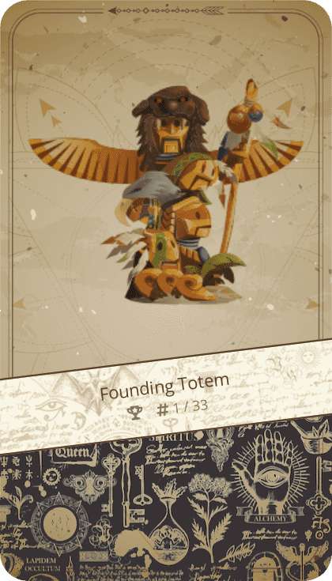

**Ability in AlchemyArena**: Does not have special ability now. Only those who have made actual contributions to the project will get it (team members, large number of LP donations, etc.)

**GameAce Cheats**: Wait to discover

**Supply**: Very rare, only 33 pieces exist

### Godhood Token

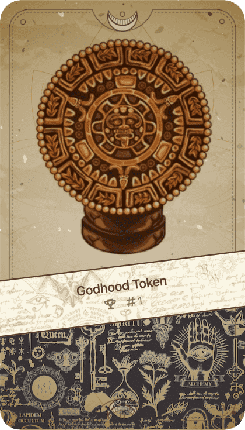

**Ability in AlchemyArena**: 20% higher XP reward when winning a challenge

**GameAce Cheats**: Wait to discover

**Supply**: Unlimited but very rare since only winners of Alchemy Toys can mint it.

### The Dragonslayer

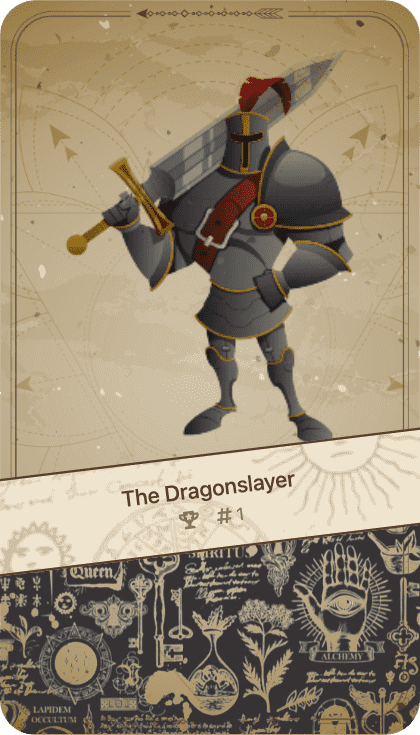

**Ability in AlchemyArena**: 10% power boost for defenders in a challenge

**GameAce Cheats**: Wait to discover

**Supply**: Unlimited but rare. Melt 2 Golden Dragons to get receive a Dragonslayer.

### Artificial Heart

**Ability in AlchemyArena**: The challenge loser keeps his Toys (regardless which side holds the Heart)

**GameAce Cheats**

[Crypto Invaders](https://gameace.at/#/invaders): Puts a shield around your ship on each level. It allows you to survive a single direct hit from bugs.

**Supply**: Limited to 99 pieces

### William Snakespeare

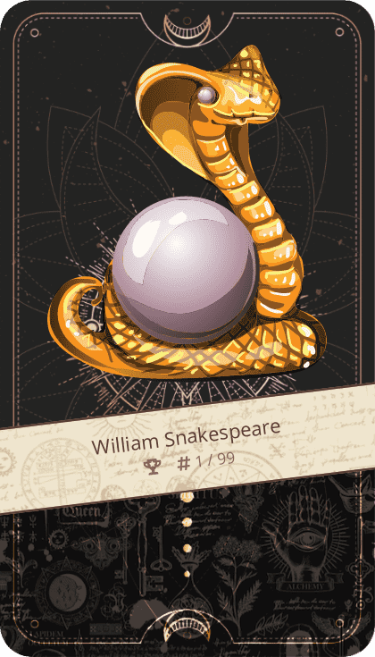

**Ability in AlchemyArena**: If the defender wins, he gets the attackers TOY (instead of burning it)

**GameAce Cheats**: Wait to discover

**Supply**: Only 99 pieces exist

### Pocket Rocket

**Ability in AlchemyArena**: Add up to +10% more power-up than maximally allowed when entering an Arena

**GameAce Cheats**

[Doggies Moon Chase](https://gameace.at/#/doggy): Pocket Rocket for Ammunition ! If you hold a Pocket Rocket TOY in your wallet, you will have 2 combat rockets in each round, that you can use to blow rocks up. Happy hunting with the "B"-Button!

**Supply**: Very rare, only 77 pieces exist

### Oldschool GPS

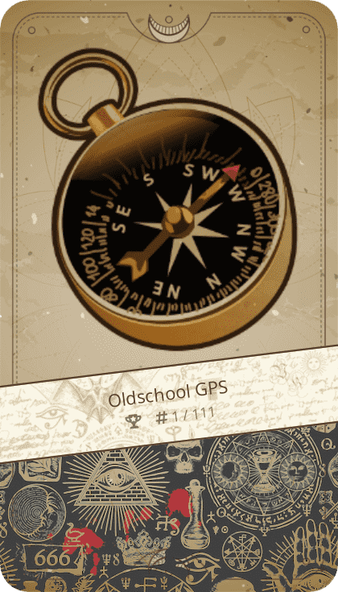

**Ability in AlchemyArena**: Attacker backs-off from challenge, if the defender is 50% stronger than attacker’s hand

**GameAce Cheats**: Wait to discover

**Supply**: Limited to 111 pieces

### GATlantis

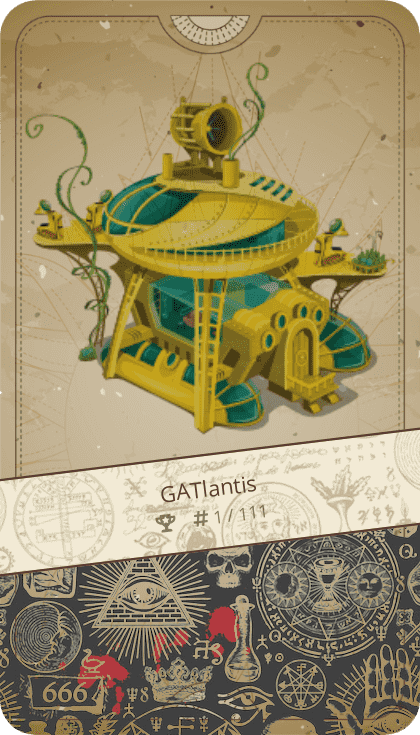

**Ability in AlchemyArena**: Defender gets ~19% of his entry fee back if his hand loses.

**GameAce Cheats**: Wait to discover

**Supply**: Only 110 pieces exist (1 burned)

### Alchemy Arena

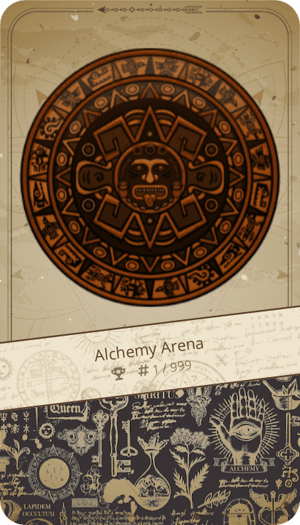

**Ability in AlchemyArena**: Doubles rewards from keeping (staking) a Hand in an Arena.

**GameAce Cheats**: Wait to discover

**Supply**: Limited to 999 pieces

### Golden Dragon

**Ability in AlchemyArena**: 25% entry fee refund when manually un-staking / leaving the Arena

**GameAce Cheats**
[Doggies Moon Chase](https://gameace.at/#/doggy): Golden Dragon for Golden Rain
(not what you think, you pervert) ! Additional coins fall down from the
sky for holders of Golden Dragon.

**Supply**: unlimited, but rare – it´s the only level 7 Toy

### Seeds of Time

**Ability in AlchemyArena**: 30% faster/shorter cooldown for defending Hands in Alchemy Arena

**GameAce Cheats**

[CryptoSnake](https://gameace.at/#/snake): Give you an ability to collect watches. If you do, for 30 seconds the speed of your snake will be reduced to the initial one. Otherwise the speed increases with each 5 coins collected.

**Supply**: Only 110 pieces exist (1 burned)

### Secret Weapon

**Ability in AlchemyArena**:  Does not have special ability now

**GameAce Cheats**

[Crypto Invaders](https://gameace.at/#/invaders): Increases the fire speed of your space ship by 100%. You will thank the universe for that cheat in higher levels!

**Supply**: 800 pieces

### Hodlpus

**Ability in AlchemyArena**:  Does not have special ability now

**GameAce Cheats**

[Missile Commander](https://gameace.at/#/missile): Doubles the speed of your own missiles allowing you to react faster and with a higher precision.

**Supply**: Only 222 pieces exist

### Recycling Bot

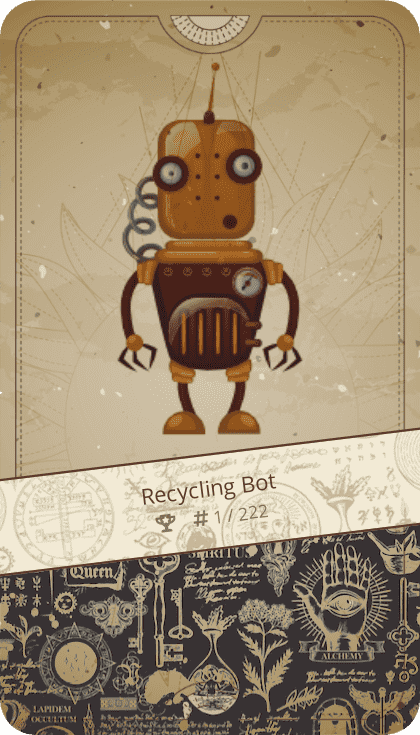

**Ability in AlchemyArena**:  Does not have special ability now

**GameAce Cheats**

[Missile Commander](https://gameace.at/#/missile): Gives you +10 extra ammunition in every level . You will need those at higher levels!

**Supply**: Only 222 pieces exist

### Xmas Wish

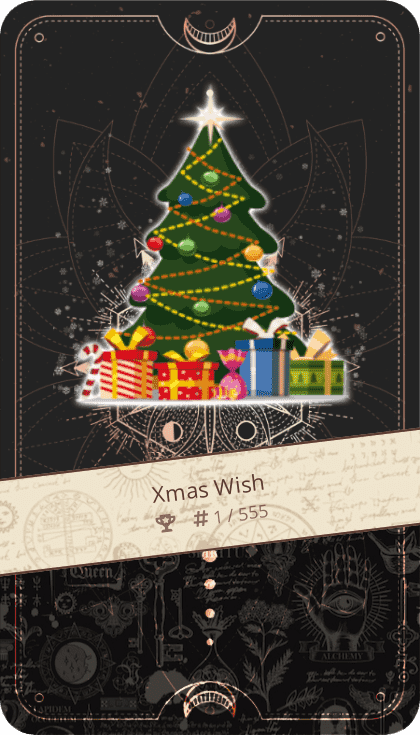

**Ability in AlchemyArena**:  Does not have special ability now

**GameAce Cheats**: Wait to discover

**Supply**: Only 555 pieces exist

### GATiger

**Ability in AlchemyArena**:  Does not have special ability now

**GameAce Cheats**: Wait to discover

**Supply**: Only 888 pieces exist

## Low-level TOYs Power-UPs and Cheats in GameAce

### Dark Elixir

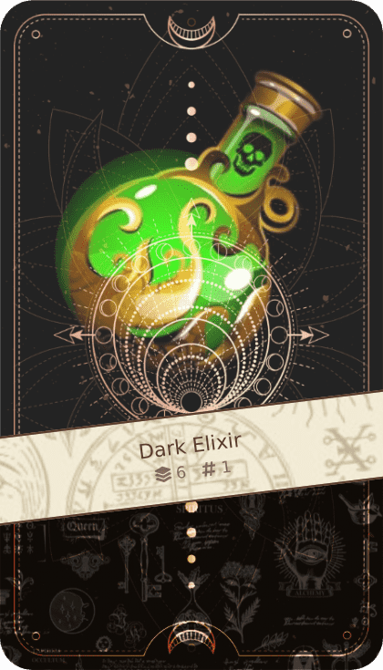

**GameAce Cheats**

[CryptoSnake](https://gameace.at/#/snake): Give you an ability to collect elixir on the board. If you do, for 30 seconds your snake will not grow, even if you collect coins.

### Book of Spells

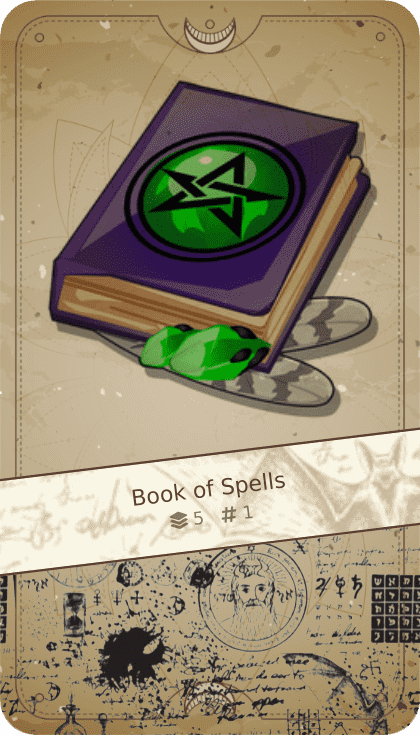

**GameAce Cheats**

[Missile Commander](https://gameace.at/#/missile): Add an extra level (11th) to your gaming experience. If you thought Level 10 was a living hell, wait for the demonic bombing that awaits you at 11th !

### Barrel of Hope

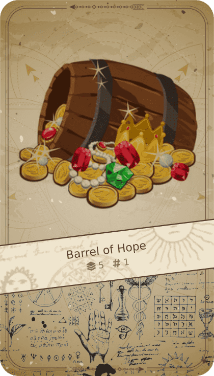

**GameAce Cheats**

[Crypto Invaders](https://gameace.at/#/invaders): Add an extra level (9th) to your gaming experience. Use this opportunity to collect more debugging points on your way to the moon!

---

Alchemy Toys has a special built-in ability for up to **63 Special Toys**. These NFTs do not have a function in Alchemy Toys, but **they will play an important role in the upcoming game [Alchemy Arena](https://gat.network/alchemy-arena/)**– and they are **highly collectible because most of them are limited**. You can see the maximum supply in each Card. If there is no limit given, they are not limited. At the moment this only counts for the Dragonslayer. All other Special Toys are limited.

Over time more Special Toys will appear (63 different types in total). **One way to get them is winning a [Challenge or get an Airdrop](https://gat.network/challenges-nft-airdrops/)… Sometimes they are also available at the [Marketplace](https://minted.vodka/) by people who have won them. Sometimes you can find Special TOYs in [Treasury Deals](https://gat.network/watch-out-collectors-special-toys-available-at-minted-vodka-very-soon/) or [Liquidity Deals](https://gat.network/win-win-buy-special-toys-with-a-discount-secure-liquidity-for-gat/).**
